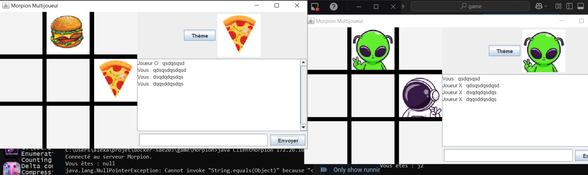

# Morpion Multijoueur

Application multijoueur du jeu de Morpion (Tic-Tac-Toe) implémentée en Java avec une architecture client-serveur et déployée via Docker.

---

## À Propos

Ce projet propose une implémentation complète du jeu de Morpion permettant à deux joueurs de s'affronter en temps réel. L'application utilise une architecture client-serveur robuste basée sur des sockets Java, avec Docker pour assurer une isolation et un déploiement faciles.

---

## Caractéristiques

- **Architecture Client-Serveur** : Communication par sockets Java en temps réel
- **Containerisation Docker** : Déploiement facile et isolation des services
- **Interface Graphique** : Interface utilisateur intuitive avec Swing
- **Thèmes Disponibles** : Mode clair et mode sombre avec plusieurs variantes visuelles
- **Gestion du Jeu** : Validation des coups et détection automatique des victoires/égalités

---

## Structure du Projet

```
.
├── Dockerfile                    # Configuration de conteneurisation
├── README.md                     # Documentation
├── game/
│   └── Morpion/                 # Composants principaux
│       ├── ServeurMorpion.java  # Serveur de jeu
│       ├── ClientMorpion.java   # Client du jeu
│       ├── Morpion.java         # Logique principale
│       └── images/              # Ressources graphiques
│           ├── clair/           # Thème clair
│           └── sombre/          # Thème sombre
├── screens/                     # Captures d'écran du projet
└── html/                        # Ressources additionnelles
```

---

## Installation et Démarrage

### Prérequis

- Docker installé sur votre système
- Docker Compose (optionnel)

### Étapes de démarrage

1. **Construire l'image Docker** :

```bash
docker build -t morpion .
```

---

## Fonctionnement

### Cycle de jeu

1. Le serveur attend la connexion de deux clients
2. Les clients se connectent et le plateau s'affiche
3. Les joueurs jouent à tour de rôle en cliquant sur les cases
4. Le serveur valide chaque coup et l'envoie aux deux clients
5. La partie se termine lorsqu'un joueur gagne ou en cas d'égalité

### Communication Client-Serveur

- Les clients envoient les coordonnées du coup joué au serveur
- Le serveur valide le coup et met à jour le plateau
- Les mises à jour sont envoyées aux deux clients en temps réel

---

## Captures d'Écran


---

## Technologie

- **Langage** : Java
- **Interface Graphique** : Swing
- **Communication** : Sockets TCP/IP
- **Containerisation** : Docker
- **Architecture** : Client-Serveur

